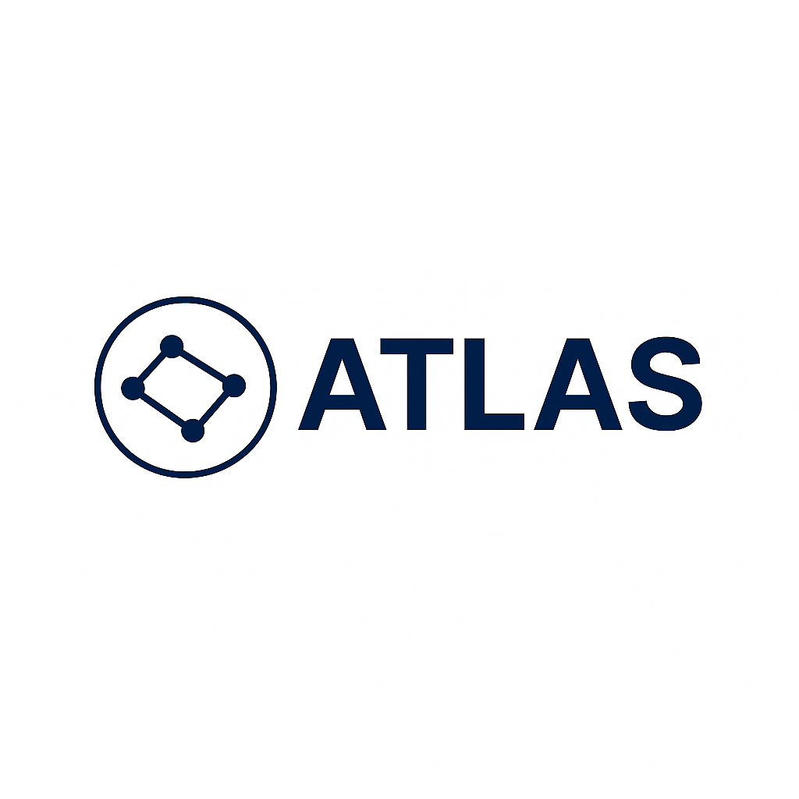

# 🚀 Atlas — AI-Powered Knowledge Mapping Platform (SaaS)

> **"AI로 지식을 그리다."** 
> 데이터 사이의 숨겨진 연결점(**The Missing Link**)을 찾아 지식 구조를 시각화하고, 고도화된 시맨틱 분석을 제공하는 **란더(Landauer)의 지능형 R&D 지식 엔진이자, SaaS 플랫폼**입니다.

  

  
  
  

---

## 🛡️ Intellectual Property & Proprietary Notice
**본 레포지토리는 란더(Landauer)의 핵심 아이디어 개발 및 지식 구조화 플랫폼인 'Atlas'의 공개 쇼케이스 환경입니다.**

* **소유권:** 본 프로젝트의 모든 원천 기술, 핵심 분석 로직, 시스템 아키텍처는 기술 지주회사 **란더(Landauer)**의 독점적 자산입니다.
* **핵심 로직 보안:** 본 플랫폼은 란더의 내부 기술 스택 연구 및 아이디어 발굴을 위한 전용 툴로 운용되며, 실제 핵심 분석 커널 및 라이선싱 서버 코드는 **란더의 폐쇄형 보안 인프라(Private Repository)** 내에서 엄격하게 관리됩니다.
* **법적 보호:** 제 C-2026-017559 호 (한국저작권위원회) 등록을 통해 법적 보호를 받으며, 무단 복제, 역공학, 상업적 도용 시 즉각적인 법적 조치가 취해집니다.

---

## 🛠 Engineering Methodology: AI-Native SDLC
Atlas는 고도로 최적화된 AI 페어 프로그래밍 워크플로우를 통해 개발 생산성과 코드의 논리적 무결성을 관리합니다. 란더의 모든 설계 의사결정은 아래의 ADR(Architectural Decision Records)을 통해 관리됩니다.

* **[docs/adr/](./docs/adr/):** 기술 부채를 최소화하고, 모든 수정 사항의 근거를 기록한 설계 의사결정 문서.

---

## 🧭 Vision: Internal Knowledge Compass
> **기술적 특이점 이후의 지식 나침반**

Atlas는 란더의 R&D 과정에서 발생하는 파편화된 아이디어를 란더의 기술 자산으로 구조화하는 지능형 내비게이터로 진화하고 있습니다. 이종 데이터 간의 시맨틱 관계를 발견하고 **지식 전이(Knowledge Transfer)**의 경로를 제시합니다.

---

## 🧩 Core Value: The "Missing Link"
- **Heterogeneous Graph Modeling**: 논문, 특허, 기술 문서 등 이종 데이터를 **Graph Data Structure**로 구조화하여 란더의 기술 위계와 관계를 정의합니다.
- **Bridge Score Algorithm**: 도메인 간 유사도를 계산하기 위해 **Cosine Similarity**와 자체 개발한 **Heuristic** 가중치 로직을 결합, 최단 연결 경로를 탐색합니다.
- **High-Dimensional Visualization**: 고차원 벡터 임베딩 데이터를 3D 지형도로 시각화하여 정보의 논리적 흐름을 직관적으로 탐색하게 합니다.

---

## 🛠 Engineering Highlights

### 1. CS-Driven Technical Challenges
- **Vector Indexing & Semantic Search**: **pgvector**와 **IVFFlat/HNSW 인덱싱** 기법을 적용하여 대규모 임베딩 데이터셋에서 $O(\log N)$ 수준의 저지연(Low-latency) 검색 구현.
- **Asynchronous Pipeline Optimization**: **FastAPI**의 `async/await` 패턴으로 I/O Bound 작업 병목을 제거하고, **Concurrency(동시성)** 처리를 통해 Throughput을 극대화.
- **SSR Hydration Consistency**: Next.js의 렌더링 생명주기를 고려한 **isMounted 패턴** 적용으로 클라이언트 사이드 지표의 무결성 확보.

### 2. Scalability & Continuous Delivery
- **Serverless AI Architecture**: **Koyeb**을 연동하여 트래픽에 따라 탄력적으로 확장되는 분석 엔진 아키텍처 설계.
- **PyPI Open Source Distribution**: 핵심 로직을 독립 라이브러리인 [**`atlas-research`**](https://pypi.org/project/atlas-research/)로 배포하여 기술적 재사용성과 모듈화를 실현.
- **Automated CI/CD**: GitHub Actions를 통한 무중단 배포 및 **1,000회 이상의 점진적 커밋**으로 시스템 안정성 유지.

---

## 🏗 System Architecture

**Presentation Layer** (Next.js/React)   
↓   
**Application Layer** (FastAPI/Python - RESTful API)   
↓   
**Data Persistence Layer** (Neon DB/pgvector - Hybrid Storage)

---

## 🎯 Development Status & Roadmap
* **Current Status**: **[Maintenance & Optimization]** 
  현재 시스템 고도화를 위한 분석 페이지 렌더링 로직 최적화 작업이 진행 중입니다. 란더의 내부 연구 환경에 맞춰 안정성을 최우선으로 개선하고 있습니다.

- [x] **Core Engine v1.4.2 저작권 등록 완료 (2026-04-07)**
- [x] **Internal Tooling**: 란더 아이디어 개발을 위한 워크플로우 이식 완료
- [ ] **Rendering Optimization**: 분석 페이지 렌더링 지연 및 하이드레이션 오류 수정 (In-Progress)
- [ ] **Semantic Discovery**: 지식 간의 비정형 연결점 추천 알고리즘 고도화

---

## 🌐 Contact & Resources
- **Landauer Official Channel**: [문의 접수처]
- **Architectural Records**: [`docs/adr/`](./docs/adr/)
